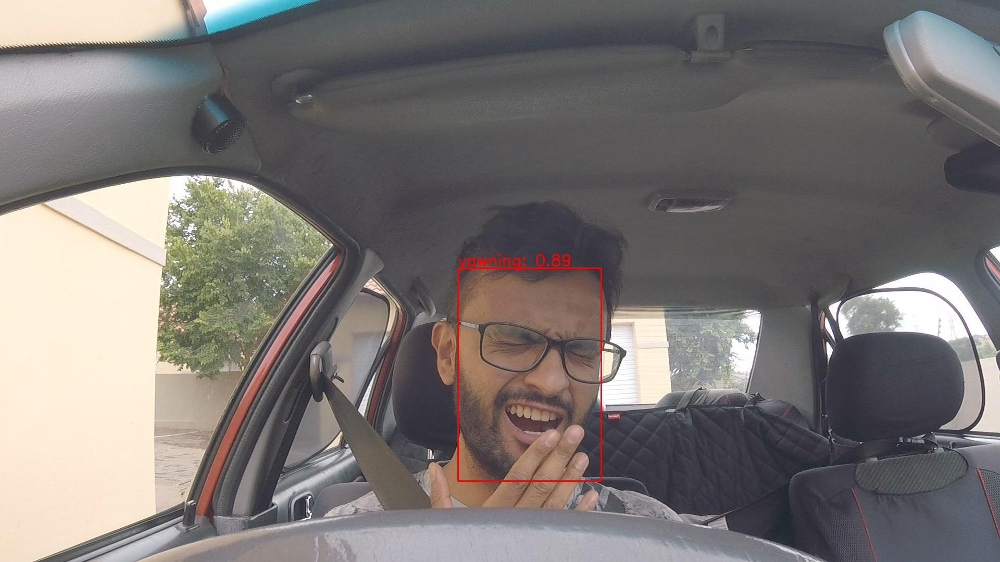

# Frame Level Driver Drowsiness Prediction

Implementation of a driver drowsiness prediction system. The [Prediction Pipeline](./pred_pipeline.py) has two stages. In stage one we detect the drivers face, using a pre-trained [retinaface](https://github.com/serengil/retinaface) model, the detected face is than fed into a [ResMaskNet](https://github.com/phamquiluan/ResidualMaskingNetwork) model, which was pretrained on the [FER2013 dataset](https://www.kaggle.com/datasets/msambare/fer2013), and finetuned for Driver Drowsiness Prediction. We fine-tune the model on a custom dataset called [FL-DDD](./data/README.md) (dataset consisting of frames from [NITYMED](https://datasets.esdalab.ece.uop.gr/download-files/), hand annotated by us). For more information please read [Frame Level Driver Drowsiness Prediction](./report.pdf).

## OOD Test

To evaluate models ability to generalize to out of distribution data, we used the following dataset:[roboflow-driver-drowsiness-detection](https://universe.roboflow.com/augmented-startups/drowsiness-detection-cntmz/dataset/1). 

### Example predictions

A set of successful predicitons:




### Performance Evaluation

The following is the performance on the ood dataset:

```
(face-detector) mean_iou: 0.51, n_detector_fails: 2
(driver-state predictor) acc: 0.83, precision: 0.83, recall: 0.76, f1-score: 0.78
```

